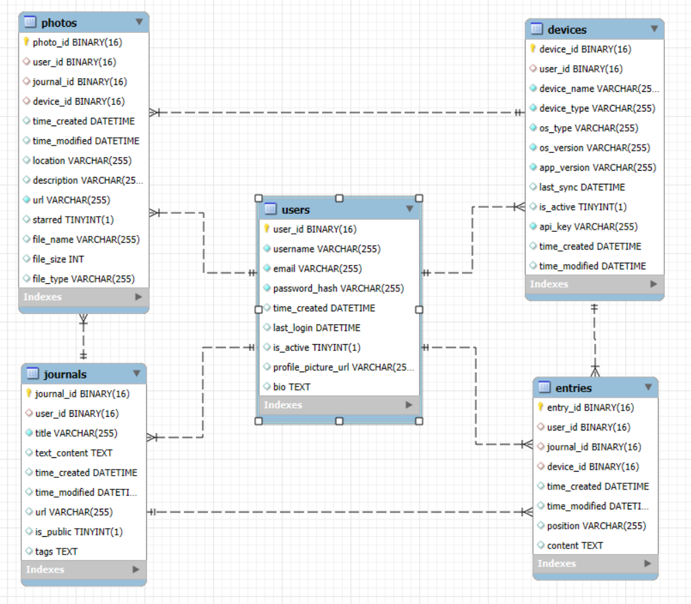

# Backend for VMBook project

## Quick Start

### Installing MySQL

Install MySQL from the official download page `https://dev.mysql.com/downloads/installer/`
This project is using version `8.0.38`.

Initialize MySQL:

```cmd
cd C:\mysql\mysql-portable\bin
mysqld --initialize-insecure
```

Start the MySQL server in the console: 
```cmd
mysqld --console
```

Environment Variables:
- Rename `.env.example` to `.env`.
- Configure necessary environment variables such as your LLM API.


### Create DB

Run `create_tables.py` in `scripts` folder.


## Stacks

- FastAPI
- MySQL

## Todos

- [x] Database design: user, device, journal, picture, text entry
- [x] MySQL Connection and create tables
- [ ] Endpoint Design
- [ ] Journal Generate


## Data Model




<!-- ### User

| Column Name | Data Type | Description |
|-------------|-----------|-------------|
| user_id     | UUID      | Primary Key |
| username    | STRING    | Unique username |
| email       | STRING    | Unique email address |
| password_hash| STRING   | Hashed password |
| time_created| DATETIME  | Account creation timestamp |
| last_login  | DATETIME  | Last login timestamp |
| is_active   | BOOLEAN   | Flag for active/inactive account |
| profile_picture_url | STRING | URL to user's profile picture |
| bio         | TEXT      | User's biography or description |


### Device

| Column Name | Data Type | Description |
|-------------|-----------|-------------|
| device_id   | UUID      | Primary Key |
| user_id     | UUID      | Foreign Key to user table |
| device_name | STRING    | Name of the device |
| device_type | STRING    | Type of device (e.g., 'smartphone', 'tablet', 'embedded') |
| os_type     | STRING    | Operating system of the device |
| os_version  | STRING    | Version of the operating system |
| app_version | STRING    | Version of the app installed on the device |
| last_sync   | DATETIME  | Timestamp of the last synchronization |
| is_active   | BOOLEAN   | Flag indicating if the device is currently active |
| api_key     | STRING    | Unique API key for this device |
| time_created| DATETIME  | When the device was first registered |
| time_modified| DATETIME | When the device information was last updated |

### Journal 

| Column Name | Data Type | Description |
|-------------|-----------|-------------|
| journal_id  | UUID      | Primary Key |
| user_id     | UUID      | Foreign Key to user table |
| title       | STRING    | Title of the journal |
| text_content| TEXT      | Main content of the journal |
| time_created| DATETIME  | Creation timestamp |
| time_modified| DATETIME | Last modification timestamp |
| url         | STRING    | URL of the journal |
| is_public   | BOOLEAN   | Flag for public/private visibility |
| tags        | TEXT[]    | Array of tags for categorization |

## Photo

| Column Name | Data Type | Description |
|-------------|-----------|-------------|
| photo_id    | UUID      | Primary Key |
| user_id     | UUID      | Foreign Key to journal table |
| journal_id  | UUID      | Foreign Key to journal table |
| device_id  | UUID      | Foreign Key to device table |
| time_created| DATETIME  | Creation timestamp |
| time_modified| DATETIME | Last modification timestamp |
| location    | STRING    | Location where the photo was taken |
| description | STRING    | Description of the photo |
| url         | STRING    | URL of the photo |
| starred     | BOOLEAN   | Flag for starred/favorite photos |
| file_name   | STRING    | Original file name |
| file_size   | INTEGER   | Size of the file in bytes |
| file_type   | STRING    | MIME type of the file |

## Entry (separate text entry)

| Column Name | Data Type | Description |
|-------------|-----------|-------------|
| entry_id    | UUID      | Primary Key |
| user_id  | UUID      | Foreign Key to user table |
| journal_id  | UUID      | Foreign Key to journal table |
| time_created| DATETIME  | Creation timestamp |
| time_modified| DATETIME | Last modification timestamp |
| position    | STRING    | Position of the entry in the journal |
| content     | STRING    | Content of the entry | -->


## API Endpoints
### Users

- `POST /users/`: Create a new user
- `GET /users/`: Get all users
- `GET /users/{user_id}`: Get a specific user
- `PUT /users/{user_id}`: Update a user
- `DELETE /users/{user_id}`: Delete a user

### Devices

- `GET /users/{user_id}/devices`: Get all devices for a user
- `GET /users/{user_id}/devices/{device_id}`: Get a specific device
- `POST /users/{user_id}/devices`: Create a new device for a user
- `PUT /users/{user_id}/devices/{device_id}`: Update a device
- `DELETE /users/{user_id}/devices/{device_id}`: Delete a device

### Journals

- `GET /users/{user_id}/journals`: Get all journals for a user
- `GET /users/{user_id}/journals/{journal_id}`: Get a specific journal
- `POST /users/{user_id}/journals`: Create a new journal for a user
- `PUT /users/{user_id}/journals/{journal_id}`: Update a journal
- `DELETE /users/{user_id}/journals/{journal_id}`: Delete a journal

### Photos

- `GET /users/{user_id}/photos`: Get all photos for a user
- `GET /users/{user_id}/photos/{photo_id}`: Get a specific photo
- `POST /users/{user_id}/photos`: Upload a new photo for a user
- `PUT /users/{user_id}/photos/{photo_id}`: Update photo details
- `DELETE /users/{user_id}/photos/{photo_id}`: Delete a photo
- `GET /users/{user_id}/photos/{photo_id}/analyze`: Analyze a photo*


## License

This project is licensed under the [MIT License](LICENSE).